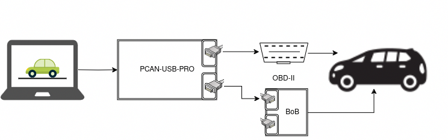

# Vehicle to Game (V2G)

This project redefines the acronym V2G to something much more useful.

**Please use with caution and ensure that you cannot accidentally drive while gaming!** <br>
For non-electric vehicles: Please be careful not to drain your 12V battery!

## Motivation

Most of their lifetime, cars stand around and do nothing. Therefore, we thought: What else we can do with our cars? Inspired by the feature of Tesla, being able to play games by using your car as a controller, we developed an open source and vehicle independent platform to use any car as a game controller.

V2G can be a great starting point if you want to tinker with your car or want to learn about the CAN bus or diagnostic communication (UDS). To make V2G work with your car, some reverse engineering of CAN messages or diagnostic communication will be required (as well as additional hardware to connect to the CAN bus). 

## Introduction
The idea is to obtain the required control information (e.g., steering angle, acceleration pedal position) from the vehicle. This information is then used to simulate a gamepad device.

We support two different modes to obtain the vehicle information:
- **Internal CAN-Bus mode**:<br>
  This mode requires access to one or more internal CAN buses of the vehicle. The assumption is that the required information is broadcasted on these busses. For each vehicle, the CAN-IDs and signal mappings have to be configured to obtain this information.
  For some vehicles, the OBD-II port is directly connected to the internal bus(es).
- **UDS mode**:<br>
  This mode uses the UDS protocol to obtain the vehicle information. UDS is a diagnostic protocol used via the OBD-II connector. For each vehicle, in addition to the CAN-ID and signal mappings, polling messages have to be specified to request the Information from the vehicle.

For both operation modes, reverse engineering is required to obtain the CAN-IDs and signal mappings. For the **Internal mode** this can be done by inspecting the CAN messages on the bus while using the actuators (e.g. turning the Steering wheel). For **UDS mode**, a diagnostic tester that supports reading the required information from the vehicle is required. With an OBD-II splitter and a second device, the communication can be sniffed and the polling messages and mappings can be obtained from there. Please make yourself familiar with CAN/UDS beforehand.

In addition, we support two different operation modes:
- **Virtual Gamepad mode**:<br>
  The CAN bus is directly connected to the computer running the game. We use [vgamepad](https://pypi.org/project/vgamepad/) to emulate a XBOX 360 controller. This runs on Linux (via socketcan) and Windows with PCAN USB adapters.
- **Bluetooth Controller mode**:<br>
  A Raspberry Pi Zero WH with CAN Hat is used to emulate a Bluetooth controller. This mode uses a modified version of [BT HID](https://github.com/Heerkog/HIDpi/tree/master) (cloned (05.04.2024))

## Supported Vehicles
### VW ID.3
#### Internal mode
The internal buses of the ID.3 separated from the OBD port by a gateway. Thus, this mode requires access to two internal buses of the vehicle, e.g. using two contactless CAN bus readers.

**VEHICLE_NAME:** ``ID3_INTERNAL``
| Control | Gamepad |
|---| ---|
| Steering wheel | X axis |
| Acceleration pedal | Y axis |
| Brake pedal | Trigger Left |
| Gear switch up | UP |
| Gear switch down | DOWN |
| Gear switch in reverse | negate Y axis (change direction & drive in reverse) |
| Gear switch in drive | stop negating Y axis  |
| headlight flasher | A |
| direction indicator left | B |

#### UDS mode
This mode requires a connection to the CAN bus on the OBD port of the ID.3.

**VEHICLE_NAME:** ``ID3_UDS``
| Control | Virtual Gamepad |
|---| ---|
| Steering wheel | X axis |
| Acceleration pedal | Y axis |
| Brake pedal | axis 1 (drive in reverse) |
| Gear switch up | UP |
| Gear switch down | DOWN |
| Gear switch in reverse | negate Y axis (change direction & drive in reverse) |
| Gear switch in drive | stop negating Y axis  |
| headlight flasher | A |
| direction indicator left | B |
| headlight on/off | Y |
| direction indicator right | X |

### Tesla Model 3 (Internal Mode)
To gain access to the CAN bus, an OBD-II adapter cable (see e.g. https://obdlink.nl/en/frequently-asked-questions/manuals/tesla-model-3-cable) is required.

**VEHICLE_NAME:** ``TESLA_MODEL_3``

| Control | Virtual Gamepad |
|---| ---|
| Steering wheel | X axis |
| Acceleration pedal | Y axis |
| Driver window down | - Y axis (drive full-speed in reverse) |
| Gear switch up | UP |
| Gear switch down | DOWN |
| Gear switch in reverse | negate Y axis (change direction & drive in reverse) |
| Gear switch in drive | stop negating Y axis  |
| headlight flasher | A |
| direction indicator left | B |
| direction indicator right | X |

## Virtual Gamepad Mode Setup
### Prerequisites
- Linux or Windows computer with Python3, Python3-venv, and pip3
- USB CAN Interface<br>
*We use the PCAN-USB Pro. However, on Linux, any socket-can compatible CAN interface should work. Make sure the interface supports CAN-FD if used by the vehicle.*

## Usage
First, connect your computer to the vehicle's CAN bus. Either use the OBD-II Port usually located in the driver's area somewhere beneath the steering wheel, or your own connection to vehicle's internal network, for example via a CAN breakout box (BoB) or a contactless CAN reader.


Make sure the CAN interface is available. 
- On **Linux**, it will be configured and started automatically by the program if they are down. However, this requires sudo and, thus, might prompt for your password.
```
$ ip a
[...]
23: can0: <NOARP,ECHO> mtu 16 qdisc noop state DOWN group default qlen 10
    link/can 
[...]
```
- On **Windows**, make sure the driver for the PCAN-USB Pro is installed and you can read CAN messages in PCAN View. However, you have to close PCAN View before running this program.


On **Linux**, to run the program, execute ``./run.sh <VEHICLE_NAME>``. On first execution, a Python venv will automatically be generated and the requirements will be installed inside. Alternatively, you can use ``./run.sh AUTO`` to run the program in automatic vehicle identification mode.
*Note that root privileges (sudo) are required for CAN interface configuration and to enable access to uinput (required for vgamepad). The progmam will run sudo and prompt for a password. If you want to avoid this, configure the interfaces and enable uinput access manually before running the program.*

Example:
```
$ ./run.sh TESLA_MODEL_3
Initializing ...
Not in BT mode
using existing venv
__     ______   ____ 
\ \   / /___ \ / ___|
 \ \ / /  __) | |  _ 
  \ V /  / __/| |_| |
   \_/  |_____|\____|
           
Virtual controller mode selected.
 *** v2g_controller ***
Loding vehicle configurations...
Configured vehicles:
 - ID3_INTERNAL
 - ID3_UDS
 - TESLA_MODEL_3
Selected vehicle:
 - TESLA_MODEL_3
Running on Linux
Using standard CAN bus on channel can0, checking interface state:
CAN interface can0 is down, attempting to bring up
Applying filters for the following IDs: ['0x129', '0x118', '0x3c2', '0x3f5']
X:  0.000, Y:  0.000, direction:  1, Brake: 0.000, Gear:  0, A: 0, B: 0, X: 0, Y: 0   
```
For testing purposes, virtual can interfaces can be used. On **Linux**, they can be created automatically by running ``./run.sh <VEHICLE_NAME> vcan

On **Windows**, you have to create the venv and install the requirements manually.
```sh
python -m venv venv
.\venv\Scripts\activate
pip install -r requirements.txt
python __main__.py -d TELSA_MODEL_3
```

## Bluetooth Mode Setup

### Prerequisites
- Raspberry Pi Zero WH
- CAN Hat RS485 (1 channel, no CAN-FD, for other CAN hats, driver installation in the `install_bt.sh` script has to be adapted)
- OBD-II adapter cable or self-created [OBD2-Adapter PCB](./OBD%20Hat/)
- supported vehicle (ID3, TESLA Model 3)
- Python 3.9 or above

DON'T configure the CAN-interface by your own; this is done based on the configuration of the respective vehicle by the run script (`run.sh`).

### Installation

First, prepare and boot the Raspberry Pi Zero WH with Raspberry Pi OS and SSH access enabled. Please make sure the user is called ``pi``.The image can be burned to a SD card with the Raspberry Pi imager. Because of the current changes in the Raspberry Pi OS, we recommend using `Raspberry Pi OS (Legacy, 32-bit) Lite`. 
```sh
# install rpi-imager with your package manager
sudo apt install rpi-imager 

# Execute and configure rpi-imager
sudo rpi-imager 
# select 'Raspberry Pi Zero', 'Raspberry Pi OS (Legacy, 32-bit) Lite', and your SD Card
# Choose Next -> Edit settings
# set hostname, e.g., 'v2g-pi'
# set username to 'pi', choose a password
# enter your WiFi SSID/password (you can use your laptop's hotspot)
```
When finished, insert the SD Card into the Pi and connect power to the Pi. This will take a while. Wait until the Pi connects to the WiFi network.

Next, copy the `v2g`-project folder to the Raspberry Pi.

```sh
scp -r <PATH_OF_YOUR_LOCAL_V2G_FOLDER> pi@<IP_OF_YOUR_RP>:~/
```

This copies the `v2g`-project folder into the home directory of your Raspberry Pi.

After that, you have to configure the Raspberry Pi as Bluetooth Game-Controller.
This is based on the HIDpi project of Heerkog (https://github.com/Heerkog/HIDpi/tree/master). We have created a deployment and configuration script, which automates the setup for you.

1. Connect to the Pi via SSH, change to the v2g directory: `cd v2g/`
2. Run `sudo bash install_bt.sh <VEHICLE_NAME>`
3. Restart: `sudo reboot`

After the reboot, the Pi should be available as Bluetooth device named ``V2G Gamepad <HOSTNAME_OF_YOUR_PI>``. You can verify that the Bluetooth connection works by connecting and running ``jstest``, e.g.:
```
$ jstest /dev/input/js0
Driver version is 2.1.0.
Joystick (V2G Gamepad v2gPi) has 2 axes (X, Y)
and 8 buttons (BtnA, BtnB, BtnC, BtnX, BtnY, BtnZ, BtnTL, BtnTR).
Testing ... (interrupt to exit)
Axes:  0:     0  1: 0 Buttons:  0:off  1:off  2:off  3:off  4:off  5:off  6:off  7:off 
```

## Contribution

If you have problems or found a bug, please open an issue on GitHub and provide all relevant information. It might take us some time to respond, so please be patient.

We welcome pull requests with improvements or new vehicle configurations. Please make sure they do not violate any intellectual property nor other laws or NDAs you might have with a manufacturer.

Please refrain from requesting additional configurations for a specific vehicle.

Also, if you are an expert on bluetooth hid devices or PCB design and have any suggestions/improvements for us, please open an issue and let us know.


## Troubleshooting
### CAN bus connection
Please verify that the CAN bus settings and the hardware connection is correct. This can, e.g., directly done with CAN utils and/or PCAN View (on Windows).
- Hardware wiring correct?
- CAN High / CAN Low not mixed up?
- Bitrate correct?
- CAN-FD required?

Also, check if the CAN interfaces have been created correctly by the program using `ip a` while the program is running.

### Testing CAN Configuration
The current button states, as derived from the CAN messages, are displayed by the program:
```
X:  0.000, Y:  0.000, direction:  1, Brake: 0.000, Gear:  0, A: 0, B: 0, X: 0, Y: 0   
```
This can be used to verify the vehicle configuration.

### Bluetooth service logs
Connect via SSH to the Pi
- Live view of service status
```sh
watch systemctl status hid
```
- Complete service log
```sh
journalctl -u hid
```
Press ``G`` to go to the end of the log file to see the latest logs.


### Device can not establish BT connection to PC
1. Connect via ssh to the Pi
2. Show connected devices with `bluetoothctl devices`
3. Remove already paired devices with `bluetoothctl remove <DEVICE MAC>`
4. Restart Bluetooth with `sudo systemctl start bluetooth`
5. Restart v2g controller with `python3 ~/v2g/__main__.py -d <VEHICLE>`

If this does not work, reinstall the Pi


### Manually starting the BT Controller

#### Default: Automatically as HID-service

Usually, the device and the according hid service should start automatically by running a hid.service.
This might fail (see troubleshooting).
In that case follow the troubleshooting or start the v2g-controller on your own, using the following methods.

#### Run from shell
```sh
run.sh -d -bt <VEHICLE>
```

#### Run as python module
```sh
python3 -m v2g -d -bt <VEHICLE>
```

#### Run as python file
```sh
python3 __main__.py -d -bt <VEHICLE>
```

## Vehicle Configuration
Vehicles are configured via python files in the [v2g_controller/vehicle_configurations](v2g_controller/vehicle_configurations/) folder. To add a new vehicle, simply add a new python file with the vehicle's name and configure the vehicle there by creating a ``VehicleConfiguration`` Object. Copy the include statements from one of the existing configuration files. See the the [vehicle configuration guide](v2g_controller/vehicle_configurations/README.md) for more information.


## License and Credits
The vehicle configuration for the VW ID.3 is published with kind permission of Volkswagen AG. The Tesla Model 3 configuration was based on publicly available information. 

The bluetooth controller emulation is based on HIDpi, which has been published under the MIT License and is Copyright 2020 by Heerko Groefsema. Our adaptions to the HIDpi code as well as everything else is also released under the MIT Licence, Copyright 2024 Applied Cyber Security Darmstadt.