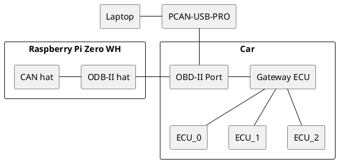
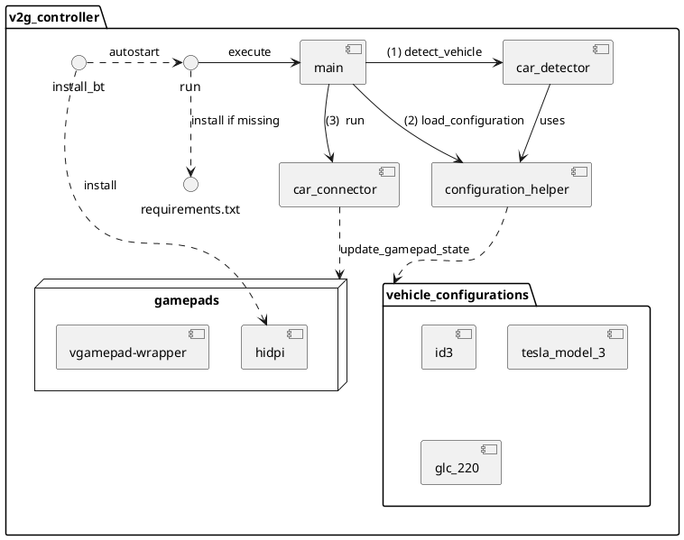
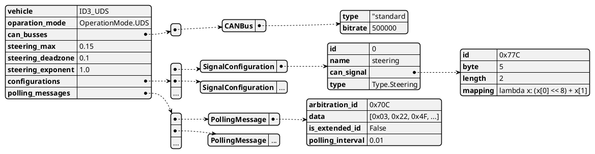

# V2G Architecture

## Hardware Setup



## Software Architecture


```puml
package hidpi {
        (helper_script)
        (sdp_record_gamepad)
        (hid.service)
        (settings.xml)
        [hid] as hh
        [main] as hm
        [service] as hs

        hm -> hs
        hm --> hh
    }

```

## Vehicle Configuration

